# Project Site Map - Sagar Rathva Portfolio

This file maps the routing structure, pages, and key components of the Sagar Rathva Portfolio website.

## 🗺️ Route Map & Hierarchy

Below is the structure of the routes defined in the application.

```mermaid
graph TD
    %% Base App Route
    App["App.js (Router & Layout)"] --> Nav["Nav Component"]
    App --> Routes["Routes Selector"]
    App --> FooterComponent["Footer Component"]

    %% Primary Routes
    Routes --> Home["/ (Home Page)"]
    Routes --> Portfolio["/Portfolio (Projects Page)"]
    Routes --> About["/About (About Me)"]
    Routes --> ToolsRoute["/Tools (Design/Dev Stack)"]
    Routes --> JourneyRoute["/Journey (Timeline)"]
    Routes --> ProcessRoute["/DesignProcess (Methods)"]
    Routes --> LifeRoute["/Life (Personal/Interests)"]
    Routes --> Contact["/Contact (Contact Form)"]
    Routes --> GS["/CaseStudy/GS (Global-Summits)"]
    Routes --> BM["/CaseStudy/BM (B2B Marketplace)"]
    Routes --> Logo["/CaseStudy/Logo (Logo Design)"]
    Routes --> NotFound["* (Fallback 404 Page)"]

    %% Home Page Sections Composition
    Home --> HeroSection["Hero Section"]
    Home --> ProjectSection["Project Grid Section"]
    Home --> ToolsSection["Tools Section"]
    Home --> JourneySection["Journey Timeline Section"]
    Home --> ProcessSection["Design Process Section"]
    Home --> LifeSection["Life/Interests Section"]
    Home --> Footer["Footer Section"]

    %% Case study links from Project Grid / Portfolio Page
    Portfolio --> GS
    Portfolio --> BM
    Portfolio --> Logo
    Portfolio --> Wellness["/NotFound (Mental Wellness app)"]
    Portfolio --> Linq["/NotFound (Linq Corporate)"]
    Portfolio --> Casino["/CaseStudy/Logo (Casino Blog Website)"]
```

---

## 📄 Page Descriptions & File Reference

| Route | Component & File Link | Description | Primary Sub-components / Sections |
| :--- | :--- | :--- | :--- |
| **`/`** | [Home.js](file:///g:/React%20js/PortfolioWebsite/src/Page/Home.js) | Main landing page serving as a single-scroll overview of the portfolio. | `Hero`, `Project`, `Tools`, `Journey`, `DesignProcess`, `Life`, `Footer` |
| **`/Portfolio`** | [ProjectPage.js](file:///g:/React%20js/PortfolioWebsite/src/Page/ProjectPage.js) | Full grid view displaying all design projects and case studies. | `Footer` |
| **`/About`** | [About.js](file:///g:/React%20js/PortfolioWebsite/src/Page/About.js) | Personal background, professional philosophy, and profile info. | `Footer` |
| **`/Tools`** | [Tools.js](file:///g:/React%20js/PortfolioWebsite/src/Page/Tools.js) | Summary of tech stack, design tools (Figma, Adobe Suite, etc.) and developer tools. | - |
| **`/Journey`** | [Journey.js](file:///g:/React%20js/PortfolioWebsite/src/Page/Journey.js) | Timeline detailing education and professional experience milestones. | - |
| **`/DesignProcess`** | [DesignProcess.js](file:///g:/React%20js/PortfolioWebsite/src/Page/DesignProcess.js) | Breakdown of UI/UX methodology (Research, Define, Ideate, Design, Test). | - |
| **`/Life`** | [Life.js](file:///g:/React%20js/PortfolioWebsite/src/Page/Life.js) | Personal insights, hobbies, and activities outside of design. | - |
| **`/Contact`** | [Contact.js](file:///g:/React%20js/PortfolioWebsite/src/Page/Contact.js) | Interactive contact form page for starting collaborations. | - |
| **`/CaseStudy/GS`** | [GS.js](file:///g:/React%20js/PortfolioWebsite/src/Page/CaseStudy/GS.js) | Dedicated case study for **Global-Summits** event portal design. | `Footer` |
| **`/CaseStudy/BM`** | [BM.js](file:///g:/React%20js/PortfolioWebsite/src/Page/CaseStudy/BM.js) | Dedicated case study for **B2B Marketplace App** design. | `Footer` |
| **`/CaseStudy/Logo`** | [LogoPage.js](file:///g:/React%20js/PortfolioWebsite/src/Page/CaseStudy/LogoPage.js) | Dedicated case study showcase for creative **Logo Designs**. | `Footer` |
| **`*` (Fallback)** | [NotFound.js](file:///g:/React%20js/PortfolioWebsite/src/Page/NotFound.js) | Custom 404 page for invalid routes or empty/broken links. | - |

---

## 🛠️ Main Application Utilities

- **Global Routing**: Defined in [App.js](file:///g:/React%20js/PortfolioWebsite/src/App.js) using `react-router-dom`.
- **Navigation Bar**: [Nav.js](file:///g:/React%20js/PortfolioWebsite/src/Page/Nav.js) displays the main page links (`Home`, `Portfolio`, `About`, `Contact`).
- **Footer**: [Footer.js](file:///g:/React%20js/PortfolioWebsite/src/Page/Footer.js) contains the PDF resume download and social link triggers.
- **Global Styles**: Imported in [index.js](file:///g:/React%20js/PortfolioWebsite/src/index.js) and configured via [index.css](file:///g:/React%20js/PortfolioWebsite/src/index.css) and [App.css](file:///g:/React%20js/PortfolioWebsite/src/App.css).
